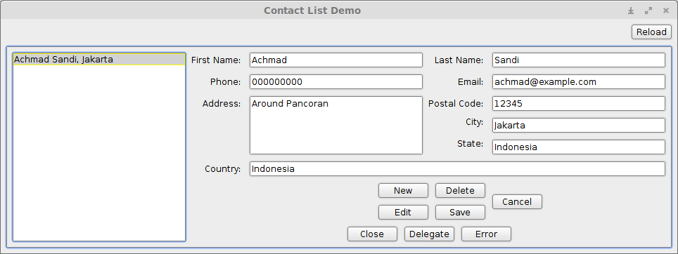

# TDD Friendly Java Swing Show Case, Java Swing Development at Ease

Having worked with Swing some years ago, it feels nostalgic to play it again with some tools I came across.
I tried the Contact List demo based on these project:

- [Swing Java Builder] (https://github.com/jacek99/javabuilders)

- [AssertJ Swing] (http://joel-costigliola.github.io/assertj/assertj-swing.html)

- [Weblookandfeel, beautiful Look and Feel ] (http://weblookandfeel.com)

Swing Java Builder simplify work of creating bloated code Swing components.
UI components declared as `.yml` resource that leverage [MigLayout](http://www.miglayout.com/) power and some added feature 
(See Swing Java Builder [doc](https://github.com/jacek99/javabuilders/raw/master/Swing%20JavaBuilder.pdf) for details).
It support live reload layout during development.
AssertJ Swing make it easy to automate UI test.

See [ContactListScenarioTest]
(https://github.com/achmadns/testable-swing/blob/master/src/test/java/com/achmadns/swing/testable/ContactListScenarioTest.java)
as starting point.

Before running it from IDE, update your Runner config if you use Intellij to leverage hot reload of `.yml` file:

